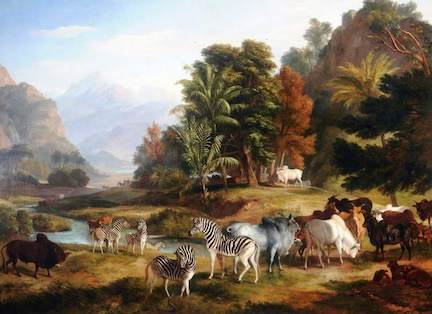

```{r setup, include=FALSE}
knitr::opts_chunk$set(echo = TRUE, warning = FALSE, message = FALSE)
```
<br>  

  

## Landscape-animal patterns  
The **LAPS** conceptual workflow and approach.  

Shrubs are cool. However, we can anchor our plant-animal interaction conceptual and data work even more broadly. The purpose of much of our research is to  examine whether there are key landscape-level predictors of animal presence, abundance, or diversity.  

### Concepts  
Here are some of the critical conceptual attributes that can move us beyond shrub-only thinking and to more reasonable estimates landscape-level drivers of change for theory, datawork, and the stakeholders in a region.  

#### Site-level predictors  
total n_shrubs  
total shrub_cover    
total NDVI  
MAP for matching years    
MAT for matching years  

There are other cool ones too - spatial contiguity, connectivity, etc but starting with these 5 for every endeavour is cool.


#### Responses  
Telemetry relocations    
Presence from cam traps    
Reported occurrence data from GBIF and other data repos  
Field survey data  
Historial data resources  
Species lists for sites    

### Workflow  
(1) Select scale. I propose site-level at first because we have so many for fires, survey, San Joaquin Desert knowledge, and Mojave data. We can also leverage extant data from the lab if we use sites we have worked it.   

(2) Build a site dataframe entitled 'site.csv' or 'sites.csv' if you say do all 6 Cuyama sites at once.Vectors include region, site, region_site, lat, long, and then your key measures such as total shrubs, total shrub cover, MAP for years that make sense or 20-30 years mean, and MAT.  Ideally, have total NDVI as a vector too.  

(3) Build a simple or complex, wide or long, presence/absence or total abundance file entitled 'observations.csv'. Provide your key vectors for join to site.csv df, perhaps just the 'region_site' vector if you elect to do more than one site at once for a region. Conceptual vectors would include total animals, then other vectors by functional group, above-below ground etc or whatever key mediators/covariates you anticipate.  

(4) Explore models and contrast with AICc scores, stepwise regression or other tools.  

(5) Explore use/occupancy/point likelihood using rsf or other tools depending on assumptions and data you have.  

### Examples
Check with Mario on landscape~bnll from telemetry.  
Check with Zoe for shrubs~birds from Google Earth and GBIF.  
Check with Marina on fire/shrubs~endangered species from US fire resources and GBIF.  
Check with Chris on shrubs~field presence in Cuyama or for Panoche.  


